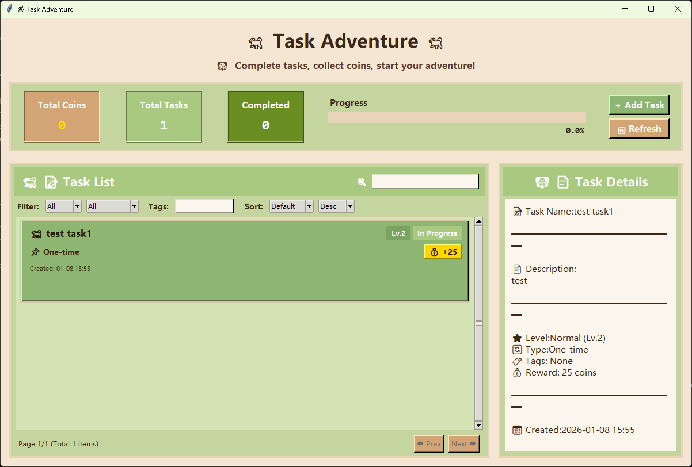

# Task Adventure Manager

Have you played *The Legend of Zelda: Breath of the Wild*, *Tears of the Kingdom*, or *Stardew Valley*? This is a desktop task management application built with Python and Tkinter, designed for personal daily task management (to-do lists) and featuring gamified design. Complete tasks, earn coins, and improve your productivity.
See the screenshots below:



## Features

- **Task Management**: Create, edit, delete, and complete tasks
- **Gamification**: Earn coins based on task difficulty levels
- **Task Levels**: Simple, Normal, Hard, Epic (different coin rewards)
- **Task Types**: One-time, daily, and weekly recurring tasks
- **Filtering and Sorting**: Filter by level, type, and tags, and sort by various criteria
- **Statistics Dashboard**: View total coins, number of tasks, and completion progress
- **Weather Forecast**: Select location to view local weather with cartoon-style display
- **Calendar View**: Daily tasks linked to calendar, switch between task and calendar views
- **Auto/Manual Refresh**: Daily tasks can be refreshed automatically or manually after completion
- **Bilingual Support**: Switch between Chinese and English globally
- **Data Persistence**: All data is automatically saved to a JSON file

## Installation

### Requirements

- Python 3.7 or higher
- tkinter (usually included with Python)

### Installing Dependencies

```bash
pip install -r requirements.txt
```

## Usage

### Running the Application

```bash
python task_manager.py
```

### Building an Executable

To build a standalone executable:

```bash
# Option 1: Using the batch file (recommended)
build.bat

# Option 2: Running the Python script directly
python build_exe.py
```

The executable will be generated in the `dist` directory.

## Task System

### Task Levels

- **Simple** (Lv.1): Reward 10 gold coins
- **Normal** (Lv.2): Reward 25 gold coins
- **Hard** (Lv.3): Reward 50 gold coins
- **Epic** (Lv.4): Reward 100 gold coins

### Task Types

- **One-time Task**: Completed once and marked as done
- **Daily Task**: Can be completed once per day, automatically refreshes
- **Weekly Task**: Can be completed once per week

## Features Details

### Weather Forecast

- Click on the weather location label to change location
- Weather data is fetched from wttr.in API
- Location preference is saved and restored on next launch

### Calendar View

- Switch between task list view and calendar view
- View daily tasks on the calendar
- Navigate between months using arrow buttons
- Click "Today" button to jump to current month

### Language Switching

- Click the language toggle button to switch between Chinese and English
- All UI elements are translated dynamically
- Task names and descriptions remain unchanged

### Daily Task Refresh

- Daily tasks automatically refresh when the date changes
- Manual refresh button available for immediate refresh
- Auto-refresh can be toggled in settings

## Keyboard Shortcuts

- `Ctrl+N`: Create a new task
- `Ctrl+F`: Focus the search box
- `F5`: Refresh the task list
- `Esc`: Clear selection

## Project Structure

```
├── task_manager.py      # Main application
├── requirements.txt     # Python dependencies
├── build_exe.py        # Executable build script
├── build.bat           # Windows batch build script
└── dist/               # Build output (automatically generated)
```

## License

Free for personal use and can be freely modified; commercial use is prohibited.

